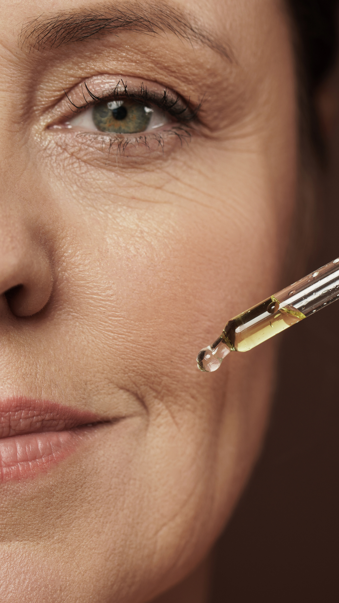
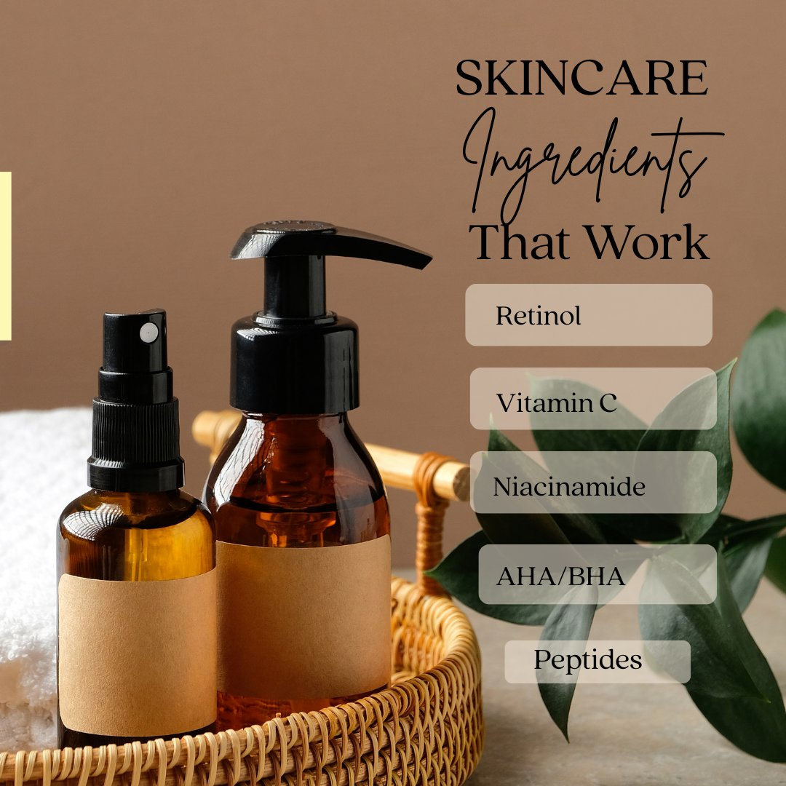
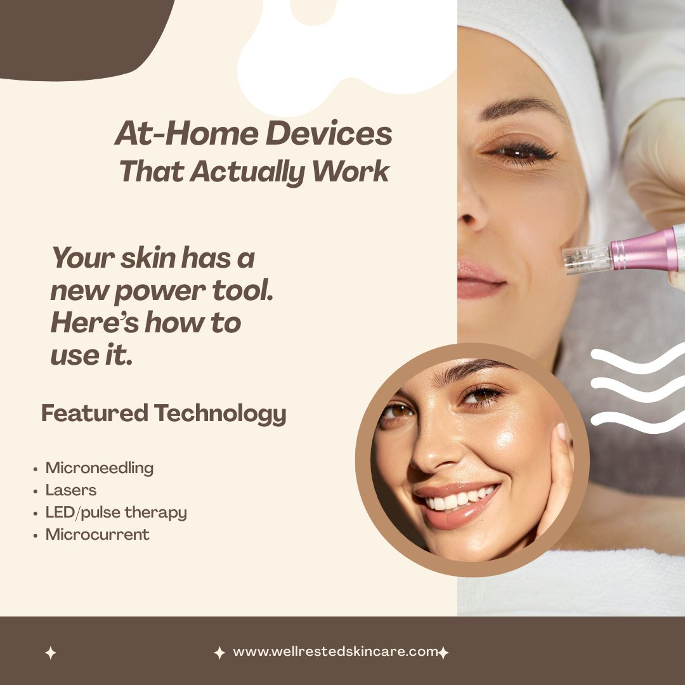
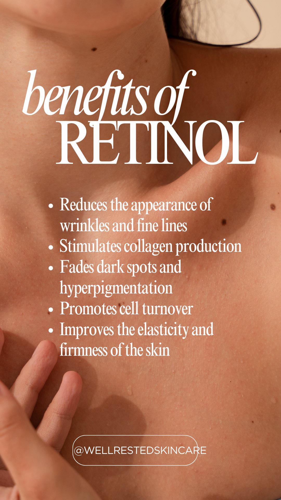

# Project: Well Rested Skincare
Last updated: 2026-03-07

## What This Project Is
Well Rested Skincare is a static HTML affiliate site that reviews and directories 24 science-backed skincare brands and at-home devices. It is monetized via affiliate links (Amazon Associates, Sovrn, Impact Radius). There is no backend — all files are plain HTML/CSS/JS.

## Tech Stack
- **Frontend:** Plain HTML/CSS/JS — no framework
- **Hosting:** GitHub Pages
- **Build process:** None — static files deployed directly
- **Version control:** GitHub — repo: github.com/kggmoran-wellrested/well-rested-skincare
- **Analytics:** Google Analytics 4 — Measurement ID: G-H93DL9R9QJ
- **Affiliate networks:** Amazon Associates, Sovrn, Impact Radius
- **Commission rates:** 3–10% depending on product/network

## File Structure
```
well-rested-skincare/
├── CLAUDE.md
├── index.html
├── brand-directory.html
├── brand-page.html               ← Dynamic template: brand-page.html?brand=[slug]
├── editorial.html
├── about.html
├── affiliate-disclosure.html
├── article-am-routine.html
├── article-actives.html
├── article-devices.html
├── robots.txt
├── sitemap.xml
├── llms.txt
├── googlec46f137391f8e5a2.html   ← Google Search Console verification — do not delete
├── CNAME
└── images/
    └── products/                 ← 47 product images (.webp format, informal filenames)
```

> **Note on article structure:** Articles currently live in the root. When article count reaches 6+, migrate to an `/articles/` subfolder and update sitemap + internal links accordingly.

## Replication Pattern
When creating a new page, always use `index.html` as the base template. Copy its full `<head>` section (including GA4, meta tags, and canonical), update the values for the new page, then build the body content. Never start a new `.html` file from scratch.

## Conventions & Rules
- ALWAYS add the GA4 tracking snippet to any new `.html` page created (Measurement ID: G-H93DL9R9QJ)
- ALWAYS add schema markup when creating new brand or article pages
- ALWAYS add a unique `<title>`, `<meta name="description">`, and `<link rel="canonical">` to every page
- NEVER link to pages that don't exist yet
- NEVER use inline styles — CSS goes in `<style>` blocks in the `<head>` of each file (no separate CSS files currently)
- Meta descriptions must be under 160 characters
- All affiliate links must include `rel="nofollow sponsored noopener"` and target="_blank"
- Brand page URL pattern: `brand-page.html?brand=[slug]`
- Article URL pattern: `article-[slug].html` (root folder until 6+ articles exist)
- Image path: `images/products/[filename].webp`
- Product image filenames use informal naming (e.g. `cerave cleanser.webp`) — always check actual GitHub filenames before referencing

## Brand Slugs (all 24)
**Skincare:** alastin, biossance, cerave, drunk-elephant, elemis, la-roche-posay, obagi, paulas-choice, plated, prequel, sk-ii, skinceuticals, summer-fridays, supergoop, tata-harper, tower28, zo

**Devices:** dr-pen, jovs, maysama, myolift, nira, nuderma, ziip

## Current SEO State
- sitemap.xml: ✅ exists and submitted to Google Search Console
- robots.txt: ✅ exists (AI crawlers allowed)
- llms.txt: ✅ exists
- Google Search Console: ✅ verified (March 7, 2026)
- GA4: ⏳ property not yet created — Measurement ID ready: G-H93DL9R9QJ
- Pages indexed by Google: pending (submitted March 7, 2026)

## Known Issues / Active Work
- [ ] GA4 tracking snippet not yet added to any pages (do all at once when confirmed)
- [ ] Organization schema not yet added to index.html
- [ ] article-actives.html missing updated meta tags and schema (not yet sent through SEO update pass)
- [ ] index.html missing updated meta tags, OG tags, and schema
- [ ] about.html missing updated meta tags
- [ ] affiliate-disclosure.html missing updated meta tags
- [ ] Individual brand pages rely on dynamic template (brand-page.html?brand=[slug]) — no static per-brand URLs yet, which limits SEO ranking per brand
- [ ] Sitemap does not yet include article-devices.html entry — needs update
- [x] robots.txt created and deployed (March 7, 2026)
- [x] sitemap.xml created and submitted (March 7, 2026)
- [x] llms.txt created and deployed (March 7, 2026)
- [x] Meta tags + schema added to: brand-directory.html, brand-page.html, article-am-routine.html, article-devices.html
- [x] Google Search Console verified (March 7, 2026)
- [x] 47 product images uploaded to images/products/
- [x] brand-page.html dynamic template built and working
- [x] editorial.html updated with devices article card (live)

## Affiliate & Business Context
- Affiliate networks: Amazon Associates, Sovrn, Impact Radius
- Disclosure page: /affiliate-disclosure.html
- Paid placements policy: None — editorial independence maintained ("0 Paid Placements")
- Commission structure: 3–10% depending on product and network
- Amazon Associates status: pending approval (need 3 sales within 180 days)
- LLC: Well Rested LLC — application submitted, pending approval
- Instagram: @wellrestedskincare

## Do Not Touch
- Do not edit the affiliate disclosure legal language in affiliate-disclosure.html
- Do not change the color scheme or typography (DM Serif Display, DM Mono, DM Sans — teal #3D7A7A)
- Do not remove the "0 Paid Placements" stat from the homepage
- Do not delete googlec46f137391f8e5a2.html — this is the Google Search Console verification file
- Do not rename or move product images in images/products/ without updating brand-page.html references

<!DOCTYPE html>
<html lang="en">
<head>
  <meta name="p:domain_verify" content="496c4766694408413a5d6f7f247835ad"/>
  <meta charset="UTF-8" />
  <meta name="viewport" content="width=device-width, initial-scale=1.0" />
  <title>Well Rested Skincare — Science-Backed Skincare That Delivers Real Results</title>
  <script type="text/javascript">
    var vglnk = {key: '2a4jylb.d6e39569-cfd5-4ae2-ab8f-07315c1f39c5'};
    (function(d, t) {
      var s = d.createElement(t);
          s.type = 'text/javascript';
          s.async = true;
          s.src = '//cdn.viglink.com/api/vglnk.js';
      var r = d.getElementsByTagName(t)[0];
          r.parentNode.insertBefore(s, r);
    }(document, 'script'));
  </script>
  <link rel="preconnect" href="https://fonts.googleapis.com" />
  <link rel="preconnect" href="https://fonts.gstatic.com" crossorigin />
  <link href="https://fonts.googleapis.com/css2?family=DM+Serif+Display:ital@0;1&family=DM+Mono:wght@300;400;500&family=DM+Sans:wght@300;400;500&display=swap" rel="stylesheet" />
  <style>
    *, *::before, *::after { box-sizing: border-box; margin: 0; padding: 0; }
    :root {
      --white: #FAFAF8; --off-white: #F2F0EB; --ink: #1A1A18;
      --ink-light: #4A4A46; --ink-faint: #9A9A94;
      --sage-pale: #D6E3D4; --sage: #B8D4B4; --teal: #3D7A7A; --teal-light: #5A9E9E;
      --accent: #C8A882; --warm: #E8D5C0; --border: #E0DDD6;
      --blush: #F0E6DC; --cream: #F7F2EC;
    }
    html { scroll-behavior: smooth; }
    body { font-family: 'DM Sans', sans-serif; background: var(--white); color: var(--ink); overflow-x: hidden; }

    /* NAV */
    nav { position: fixed; top: 0; left: 0; right: 0; z-index: 100; display: flex; align-items: center; justify-content: space-between; padding: 0 48px; height: 60px; background: rgba(250,250,248,0.92); backdrop-filter: blur(12px); border-bottom: 1px solid var(--border); }
    .nav-logo { font-family: 'DM Serif Display', serif; font-size: 17px; color: var(--ink); text-decoration: none; }
    .nav-logo span { color: var(--teal); }
    .nav-links { display: flex; gap: 30px; list-style: none; }
    .nav-links a { font-family: 'DM Mono', monospace; font-size: 10px; letter-spacing: 0.1em; text-transform: uppercase; color: var(--ink-light); text-decoration: none; transition: color 0.2s; }
    .nav-links a:hover { color: var(--teal); }
    .nav-cta { font-family: 'DM Mono', monospace; font-size: 10px; letter-spacing: 0.1em; text-transform: uppercase; color: var(--white); background: var(--teal); border: none; padding: 9px 20px; cursor: pointer; transition: background 0.2s; }
    .nav-cta:hover { background: var(--teal-light); }

    /* TICKER */
    .ticker { background: var(--teal); padding: 10px 0; overflow: hidden; margin-top: 60px; }
    .ticker-track { display: flex; gap: 0; animation: ticker 30s linear infinite; white-space: nowrap; }
    .ticker-item { font-family: 'DM Mono', monospace; font-size: 10px; letter-spacing: 0.14em; text-transform: uppercase; color: rgba(255,255,255,0.7); padding: 0 32px; border-right: 1px solid rgba(255,255,255,0.2); flex-shrink: 0; }
    @keyframes ticker { from { transform: translateX(0); } to { transform: translateX(-50%); } }

    /* HERO */
    .hero { min-height: 92vh; display: grid; grid-template-columns: 1fr 1fr; position: relative; overflow: hidden; }
    .hero-left { display: flex; flex-direction: column; justify-content: center; padding: 80px 64px; position: relative; z-index: 2; background: var(--cream); }

    /* warm organic blob shapes in background */
    .hero-left::before { content: ''; position: absolute; width: 500px; height: 500px; border-radius: 60% 40% 70% 30% / 50% 60% 40% 50%; background: radial-gradient(ellipse, rgba(200,168,130,0.15), transparent 70%); top: -100px; right: -100px; z-index: 0; animation: morphBlob 12s ease-in-out infinite; }
    .hero-left::after { content: ''; position: absolute; width: 300px; height: 300px; border-radius: 40% 60% 30% 70% / 60% 40% 70% 30%; background: radial-gradient(ellipse, rgba(61,122,122,0.08), transparent 70%); bottom: 40px; left: 40px; z-index: 0; animation: morphBlob 16s ease-in-out infinite reverse; }
    @keyframes morphBlob { 0%, 100% { border-radius: 60% 40% 70% 30% / 50% 60% 40% 50%; } 50% { border-radius: 30% 70% 40% 60% / 60% 30% 70% 40%; } }

    .hero-eyebrow { font-family: 'DM Mono', monospace; font-size: 10px; letter-spacing: 0.18em; text-transform: uppercase; color: var(--teal); margin-bottom: 24px; display: flex; align-items: center; gap: 10px; opacity: 0; animation: fadeUp 0.7s 0.1s forwards; position: relative; z-index: 1; }
    .hero-eyebrow::before { content: ''; display: block; width: 24px; height: 1px; background: var(--teal); }
    .hero-headline { font-family: 'DM Serif Display', serif; font-size: clamp(38px, 4.5vw, 62px); letter-spacing: -1.5px; line-height: 1.05; margin-bottom: 12px; opacity: 0; animation: fadeUp 0.7s 0.25s forwards; position: relative; z-index: 1; }
    .hero-headline em { font-style: italic; color: var(--teal); }
    .hero-tagline { font-family: 'DM Serif Display', serif; font-style: italic; font-size: 20px; color: var(--ink-light); margin-bottom: 28px; opacity: 0; animation: fadeUp 0.7s 0.35s forwards; position: relative; z-index: 1; }
    .hero-body { font-size: 15px; font-weight: 300; line-height: 1.85; color: var(--ink-light); max-width: 420px; margin-bottom: 36px; opacity: 0; animation: fadeUp 0.7s 0.45s forwards; position: relative; z-index: 1; }
    .hero-actions { display: flex; gap: 14px; opacity: 0; animation: fadeUp 0.7s 0.55s forwards; position: relative; z-index: 1; }
    .btn-primary { font-family: 'DM Mono', monospace; font-size: 11px; letter-spacing: 0.1em; text-transform: uppercase; background: var(--teal); color: var(--white); border: none; padding: 14px 28px; cursor: pointer; transition: background 0.2s; text-decoration: none; display: inline-block; }
    .btn-primary:hover { background: var(--ink); }
    .btn-secondary { font-family: 'DM Mono', monospace; font-size: 11px; letter-spacing: 0.1em; text-transform: uppercase; background: none; color: var(--teal); border: 1px solid var(--teal); padding: 14px 28px; cursor: pointer; transition: all 0.2s; text-decoration: none; display: inline-block; }
    .btn-secondary:hover { background: var(--teal); color: var(--white); }

    /* HERO RIGHT — warm lifestyle panel */
    .hero-right { position: relative; overflow: hidden; background: var(--blush); opacity: 0; animation: fadeIn 1s 0.3s forwards; }
    .hero-right-organic { position: absolute; inset: 0; }
    .hero-right-organic::before { content: ''; position: absolute; width: 600px; height: 600px; border-radius: 60% 40% 55% 45% / 45% 55% 45% 55%; background: radial-gradient(ellipse at 60% 40%, rgba(200,168,130,0.25), transparent 60%); top: -100px; left: -100px; animation: morphBlob 14s ease-in-out infinite; }
    .hero-right-organic::after { content: ''; position: absolute; width: 400px; height: 400px; border-radius: 40% 60% 45% 55% / 55% 45% 60% 40%; background: radial-gradient(ellipse at 40% 60%, rgba(61,122,122,0.12), transparent 60%); bottom: -50px; right: -50px; animation: morphBlob 18s ease-in-out infinite reverse; }
    .hero-right-content { position: absolute; inset: 0; display: flex; flex-direction: column; justify-content: center; align-items: center; padding: 64px; z-index: 1; }
    .hero-right-wordmark { font-family: 'DM Serif Display', serif; font-size: 52px; color: var(--ink); letter-spacing: -2px; line-height: 1.05; text-align: center; margin-bottom: 8px; }
    .hero-right-wordmark span { color: var(--teal); display: block; font-style: italic; }
    .hero-right-sub { font-family: 'DM Mono', monospace; font-size: 10px; letter-spacing: 0.2em; text-transform: uppercase; color: var(--ink-faint); margin-bottom: 56px; }
    .hero-circle { width: 180px; height: 180px; border-radius: 50%; border: 1px solid rgba(61,122,122,0.2); display: flex; align-items: center; justify-content: center; margin: 0 auto 56px; position: relative; }
    .hero-circle::before { content: ''; position: absolute; inset: 12px; border-radius: 50%; background: radial-gradient(ellipse, rgba(200,168,130,0.2), transparent); }
    .hero-circle-text { font-family: 'DM Serif Display', serif; font-style: italic; font-size: 22px; color: var(--teal); text-align: center; line-height: 1.3; z-index: 1; }
    .hero-trust-pills { display: flex; flex-direction: column; gap: 10px; width: 100%; }
    .trust-pill { display: flex; align-items: center; gap: 12px; padding: 12px 18px; background: rgba(255,255,255,0.6); border: 1px solid rgba(61,122,122,0.12); backdrop-filter: blur(8px); }
    .trust-pill-dot { width: 6px; height: 6px; border-radius: 50%; background: var(--teal); flex-shrink: 0; }
    .trust-pill-text { font-family: 'DM Mono', monospace; font-size: 9px; letter-spacing: 0.1em; text-transform: uppercase; color: var(--ink-light); }

    /* MANIFESTO */
    .manifesto { padding: 120px 64px; background: var(--white); position: relative; overflow: hidden; }
    .manifesto::before { content: ''; position: absolute; width: 800px; height: 800px; border-radius: 50%; background: radial-gradient(ellipse, rgba(214,227,212,0.3), transparent 70%); top: -200px; right: -200px; pointer-events: none; }
    .manifesto-inner { max-width: 900px; margin: 0 auto; position: relative; z-index: 1; }
    .manifesto-eyebrow { font-family: 'DM Mono', monospace; font-size: 10px; letter-spacing: 0.18em; text-transform: uppercase; color: var(--teal); margin-bottom: 24px; display: flex; align-items: center; gap: 10px; }
    .manifesto-eyebrow::before { content: ''; display: block; width: 24px; height: 1px; background: var(--teal); }
    .manifesto-headline { font-family: 'DM Serif Display', serif; font-size: clamp(32px, 4vw, 52px); letter-spacing: -1px; line-height: 1.1; margin-bottom: 48px; }
    .manifesto-headline em { font-style: italic; color: var(--teal); }
    .manifesto-body { display: grid; grid-template-columns: 1fr 1fr; gap: 48px; align-items: start; }
    .manifesto-text p { font-size: 16px; font-weight: 300; line-height: 1.9; color: var(--ink-light); margin-bottom: 20px; }
    .manifesto-text p strong { font-weight: 500; color: var(--ink); }
    .manifesto-text p:last-child { margin-bottom: 0; }
    .manifesto-quote { background: var(--teal); padding: 48px; position: relative; }
    .manifesto-quote::before { content: '\201C'; font-family: 'DM Serif Display', serif; font-size: 120px; color: rgba(255,255,255,0.1); position: absolute; top: -20px; left: 24px; line-height: 1; }
    .manifesto-quote-text { font-family: 'DM Serif Display', serif; font-size: 26px; color: var(--white); line-height: 1.3; letter-spacing: -0.3px; margin-bottom: 20px; position: relative; z-index: 1; }
    .manifesto-quote-text em { font-style: italic; color: rgba(255,255,255,0.7); }
    .manifesto-quote-sig { font-family: 'DM Mono', monospace; font-size: 9px; letter-spacing: 0.14em; text-transform: uppercase; color: rgba(255,255,255,0.4); }

    /* STATS BAR */
    .stats-bar { background: var(--off-white); border-top: 1px solid var(--border); border-bottom: 1px solid var(--border); display: grid; grid-template-columns: repeat(4, 1fr); }
    .stat-item { padding: 40px 32px; border-right: 1px solid var(--border); text-align: center; }
    .stat-item:last-child { border-right: none; }
    .stat-num { font-family: 'DM Serif Display', serif; font-size: 48px; color: var(--teal); letter-spacing: -2px; line-height: 1; margin-bottom: 8px; }
    .stat-label { font-family: 'DM Mono', monospace; font-size: 9px; letter-spacing: 0.14em; text-transform: uppercase; color: var(--ink-faint); }

    /* FOUNDER NOTE */
    .founder-section { padding: 100px 64px; background: var(--cream); border-top: 1px solid var(--border); border-bottom: 1px solid var(--border); }
    .founder-inner { display: grid; grid-template-columns: 160px 1fr; gap: 64px; align-items: center; max-width: 900px; margin: 0 auto; }
    .founder-left { display: flex; justify-content: center; }
    .founder-monogram { width: 120px; height: 120px; border-radius: 50%; background: var(--teal); display: flex; align-items: center; justify-content: center; font-family: 'DM Serif Display', serif; font-size: 52px; color: var(--white); font-style: italic; }
    .founder-eyebrow { font-family: 'DM Mono', monospace; font-size: 10px; letter-spacing: 0.18em; text-transform: uppercase; color: var(--teal); margin-bottom: 16px; display: flex; align-items: center; gap: 10px; }
    .founder-eyebrow::before { content: ''; display: block; width: 20px; height: 1px; background: var(--teal); }
    .founder-headline { font-family: 'DM Serif Display', serif; font-size: clamp(22px, 2.5vw, 32px); letter-spacing: -0.5px; line-height: 1.15; margin-bottom: 20px; }
    .founder-headline em { font-style: italic; color: var(--teal); }
    .founder-body { font-size: 15px; font-weight: 300; line-height: 1.85; color: var(--ink-light); margin-bottom: 14px; }
    .founder-link { font-family: 'DM Mono', monospace; font-size: 10px; letter-spacing: 0.12em; text-transform: uppercase; color: var(--teal); text-decoration: none; display: inline-flex; align-items: center; gap: 6px; margin-top: 8px; transition: color 0.2s; }
    .founder-link:hover { color: var(--ink); }

    /* FEATURED BRANDS */
    .featured-section { padding: 100px 64px; background: var(--white); }
    .section-header { display: flex; align-items: flex-end; justify-content: space-between; margin-bottom: 56px; }
    .section-eyebrow { font-family: 'DM Mono', monospace; font-size: 10px; letter-spacing: 0.18em; text-transform: uppercase; color: var(--teal); margin-bottom: 14px; display: flex; align-items: center; gap: 10px; }
    .section-eyebrow::before { content: ''; display: block; width: 20px; height: 1px; background: var(--teal); }
    .section-title { font-family: 'DM Serif Display', serif; font-size: clamp(28px, 3vw, 42px); letter-spacing: -0.8px; line-height: 1.1; }
    .section-title em { font-style: italic; color: var(--teal); }
    .section-link { font-family: 'DM Mono', monospace; font-size: 10px; letter-spacing: 0.1em; text-transform: uppercase; color: var(--teal); text-decoration: none; transition: color 0.2s; white-space: nowrap; }
    .section-link:hover { color: var(--ink); }
    .brands-grid { display: grid; grid-template-columns: repeat(3, 1fr); gap: 1px; background: var(--border); }
    .brand-card { background: var(--white); padding: 32px; cursor: pointer; transition: background 0.2s; position: relative; overflow: hidden; text-decoration: none; display: block; }
    .brand-card:hover { background: var(--cream); }
    .brand-card:hover .brand-card-bar { width: 100%; }
    .brand-card:hover .brand-card-arrow { opacity: 1; transform: translate(3px,-3px); }
    .brand-card-bar { position: absolute; top: 0; left: 0; height: 2px; width: 0; background: var(--teal); transition: width 0.4s; }
    .brand-card-top { display: flex; align-items: flex-start; justify-content: space-between; margin-bottom: 18px; }
    .brand-initials { width: 48px; height: 48px; background: var(--off-white); border: 1px solid var(--border); display: flex; align-items: center; justify-content: center; font-family: 'DM Serif Display', serif; font-size: 14px; color: var(--teal); }
    .brand-badge { font-family: 'DM Mono', monospace; font-size: 8px; letter-spacing: 0.1em; text-transform: uppercase; padding: 3px 8px; background: var(--teal); color: var(--white); }
    .brand-cat { font-family: 'DM Mono', monospace; font-size: 9px; letter-spacing: 0.12em; text-transform: uppercase; color: var(--ink-faint); margin-bottom: 6px; }
    .brand-name { font-family: 'DM Serif Display', serif; font-size: 20px; color: var(--ink); margin-bottom: 10px; }
    .brand-desc { font-size: 13px; font-weight: 300; line-height: 1.7; color: var(--ink-light); margin-bottom: 18px; }
    .brand-card-footer { display: flex; align-items: center; justify-content: space-between; padding-top: 16px; border-top: 1px solid var(--border); }
    .brand-rating { font-family: 'DM Mono', monospace; font-size: 11px; color: var(--ink-light); }
    .brand-card-arrow { color: var(--teal); font-size: 16px; opacity: 0; transition: all 0.25s; }

    /* HOW IT WORKS */
    .how-section { padding: 100px 64px; background: var(--off-white); border-top: 1px solid var(--border); position: relative; overflow: hidden; }
    .how-section::after { content: ''; position: absolute; width: 600px; height: 600px; border-radius: 50%; background: radial-gradient(ellipse, rgba(200,168,130,0.15), transparent 70%); bottom: -200px; left: -100px; pointer-events: none; }
    .how-grid { display: grid; grid-template-columns: repeat(3, 1fr); gap: 1px; background: var(--border); margin-top: 56px; position: relative; z-index: 1; }
    .how-card { background: var(--white); padding: 40px; transition: background 0.2s; }
    .how-card:hover { background: var(--cream); }
    .how-num { font-family: 'DM Serif Display', serif; font-size: 64px; color: var(--border); line-height: 1; margin-bottom: 16px; }
    .how-title { font-family: 'DM Serif Display', serif; font-size: 22px; color: var(--ink); margin-bottom: 12px; }
    .how-title em { font-style: italic; color: var(--teal); }
    .how-body { font-size: 13px; font-weight: 300; line-height: 1.75; color: var(--ink-light); }

    /* EDITORIAL */
    .editorial-section { padding: 100px 64px; background: var(--white); border-top: 1px solid var(--border); }
    .editorial-grid { display: grid; grid-template-columns: 2fr 1fr 1fr 1fr 1fr; gap: 1px; background: var(--border); margin-top: 56px; }
    .editorial-card { background: var(--white); padding: 36px; cursor: pointer; transition: background 0.2s; text-decoration: none; display: block; }
    .editorial-card:hover { background: var(--cream); }
    .editorial-card.featured { padding: 48px; }
    .editorial-card.has-image { padding: 0; overflow: hidden; }
    .editorial-card.has-image:hover { background: var(--white); }
    .ed-card-image { width: 100%; aspect-ratio: 1/1; overflow: hidden; }
    .ed-card-image img { width: 100%; height: 100%; object-fit: cover; display: block; transition: transform 0.5s ease; }
    .editorial-card.has-image:hover .ed-card-image img { transform: scale(1.04); }
    .ed-card-body { padding: 24px; }
    .ed-cat { font-family: 'DM Mono', monospace; font-size: 9px; letter-spacing: 0.14em; text-transform: uppercase; color: var(--teal); margin-bottom: 14px; }
    .ed-title { font-family: 'DM Serif Display', serif; font-size: 22px; color: var(--ink); line-height: 1.2; margin-bottom: 12px; letter-spacing: -0.3px; }
    .editorial-card.featured .ed-title { font-size: 32px; letter-spacing: -0.8px; }
    .ed-excerpt { font-size: 13px; font-weight: 300; line-height: 1.7; color: var(--ink-light); margin-bottom: 20px; }
    .ed-meta { font-family: 'DM Mono', monospace; font-size: 9px; letter-spacing: 0.1em; text-transform: uppercase; color: var(--ink-faint); }

    /* SKIN TYPE SECTION */
    .skin-section { padding: 100px 64px; background: var(--ink); position: relative; overflow: hidden; }
    .skin-section::before { content: ''; position: absolute; width: 700px; height: 700px; border-radius: 50%; background: radial-gradient(ellipse, rgba(61,122,122,0.15), transparent 70%); top: -200px; right: -200px; }
    .skin-section::after { content: ''; position: absolute; width: 400px; height: 400px; border-radius: 50%; background: radial-gradient(ellipse, rgba(200,168,130,0.08), transparent 70%); bottom: -100px; left: -100px; }
    .skin-inner { position: relative; z-index: 1; }
    .skin-eyebrow { font-family: 'DM Mono', monospace; font-size: 10px; letter-spacing: 0.18em; text-transform: uppercase; color: var(--teal-light); margin-bottom: 20px; display: flex; align-items: center; gap: 10px; }
    .skin-eyebrow::before { content: ''; display: block; width: 24px; height: 1px; background: var(--teal-light); }
    .skin-headline { font-family: 'DM Serif Display', serif; font-size: clamp(32px, 4vw, 52px); color: var(--white); letter-spacing: -1px; line-height: 1.1; margin-bottom: 16px; }
    .skin-headline em { font-style: italic; color: var(--teal-light); }
    .skin-sub { font-size: 15px; font-weight: 300; color: rgba(255,255,255,0.5); margin-bottom: 56px; max-width: 480px; line-height: 1.7; }
    .skin-types { display: grid; grid-template-columns: repeat(4, 1fr); gap: 1px; background: rgba(255,255,255,0.06); }
    .skin-type { padding: 32px 28px; background: rgba(255,255,255,0.03); cursor: pointer; transition: background 0.2s; border: 1px solid transparent; }
    .skin-type:hover { background: rgba(255,255,255,0.07); border-color: rgba(61,122,122,0.4); }
    .skin-type-icon { font-size: 28px; margin-bottom: 14px; }
    .skin-type-name { font-family: 'DM Serif Display', serif; font-size: 20px; color: var(--white); margin-bottom: 8px; }
    .skin-type-desc { font-size: 12px; font-weight: 300; color: rgba(255,255,255,0.4); line-height: 1.6; margin-bottom: 16px; }
    .skin-type-link { font-family: 'DM Mono', monospace; font-size: 9px; letter-spacing: 0.1em; text-transform: uppercase; color: var(--teal-light); text-decoration: none; }

    /* NEWSLETTER */
    .newsletter { padding: 100px 64px; background: var(--blush); border-top: 1px solid var(--border); position: relative; overflow: hidden; }
    .newsletter::before { content: ''; position: absolute; width: 600px; height: 600px; border-radius: 50%; background: radial-gradient(ellipse, rgba(200,168,130,0.2), transparent 70%); top: -200px; right: -100px; }
    .newsletter-inner { position: relative; z-index: 1; max-width: 600px; }
    .newsletter-eyebrow { font-family: 'DM Mono', monospace; font-size: 10px; letter-spacing: 0.18em; text-transform: uppercase; color: var(--teal); margin-bottom: 20px; display: flex; align-items: center; gap: 10px; }
    .newsletter-eyebrow::before { content: ''; display: block; width: 24px; height: 1px; background: var(--teal); }
    .newsletter-title { font-family: 'DM Serif Display', serif; font-size: clamp(28px, 3.5vw, 44px); letter-spacing: -1px; line-height: 1.1; margin-bottom: 16px; }
    .newsletter-title em { font-style: italic; color: var(--teal); }
    .newsletter-sub { font-size: 15px; font-weight: 300; color: var(--ink-light); margin-bottom: 36px; line-height: 1.7; }
    .newsletter-form { display: flex; gap: 0; max-width: 460px; }
    .newsletter-input { flex: 1; font-family: 'DM Sans', sans-serif; font-size: 14px; font-weight: 300; padding: 14px 20px; border: 1px solid var(--border); border-right: none; background: var(--white); color: var(--ink); outline: none; transition: border-color 0.2s; }
    .newsletter-input:focus { border-color: var(--teal); }
    .newsletter-btn { font-family: 'DM Mono', monospace; font-size: 10px; letter-spacing: 0.1em; text-transform: uppercase; background: var(--teal); color: var(--white); border: none; padding: 14px 24px; cursor: pointer; transition: background 0.2s; white-space: nowrap; }
    .newsletter-btn:hover { background: var(--ink); }
    .newsletter-perks { display: flex; gap: 24px; margin-top: 20px; flex-wrap: wrap; }
    .newsletter-perk { font-family: 'DM Mono', monospace; font-size: 9px; letter-spacing: 0.1em; text-transform: uppercase; color: var(--ink-faint); display: flex; align-items: center; gap: 6px; }
    .newsletter-perk::before { content: '✓'; color: var(--teal); }

    /* FOOTER */
    footer { background: var(--ink); padding: 56px 64px; display: grid; grid-template-columns: 2fr 1fr 1fr 1fr; gap: 44px; }
    .footer-logo { font-family: 'DM Serif Display', serif; font-size: 20px; color: var(--white); margin-bottom: 14px; }
    .footer-logo span { color: var(--teal-light); }
    .footer-tagline { font-size: 13px; font-weight: 300; line-height: 1.7; color: rgba(255,255,255,0.3); max-width: 240px; margin-bottom: 20px; }
    .footer-social { display: flex; gap: 12px; }
    .footer-social-link { width: 32px; height: 32px; border: 1px solid rgba(255,255,255,0.1); display: flex; align-items: center; justify-content: center; color: rgba(255,255,255,0.3); text-decoration: none; font-size: 12px; transition: all 0.2s; }
    .footer-social-link:hover { border-color: var(--teal-light); color: var(--teal-light); }
    .footer-col-title { font-family: 'DM Mono', monospace; font-size: 9px; letter-spacing: 0.16em; text-transform: uppercase; color: rgba(255,255,255,0.22); margin-bottom: 18px; }
    .footer-links { list-style: none; display: flex; flex-direction: column; gap: 11px; }
    .footer-links a { font-size: 13px; font-weight: 300; color: rgba(255,255,255,0.4); text-decoration: none; transition: color 0.2s; }
    .footer-links a:hover { color: var(--teal-light); }
    .footer-bottom { background: var(--ink); padding: 18px 64px; border-top: 1px solid rgba(255,255,255,0.06); display: flex; align-items: center; justify-content: space-between; }
    .footer-bottom-text { font-family: 'DM Mono', monospace; font-size: 9px; letter-spacing: 0.08em; color: rgba(255,255,255,0.16); }

    .reveal { opacity: 0; transform: translateY(20px); transition: opacity 0.7s ease, transform 0.7s ease; }
    .reveal.visible { opacity: 1; transform: translateY(0); }
    @keyframes fadeUp { from { opacity: 0; transform: translateY(16px); } to { opacity: 1; transform: translateY(0); } }
    @keyframes fadeIn { from { opacity: 0; } to { opacity: 1; } }

    /* FLATLAY GALLERY */
    .flatlay-section { padding: 100px 64px; background: var(--off-white); border-top: 1px solid var(--border); border-bottom: 1px solid var(--border); }
    .flatlay-header { display: flex; align-items: flex-end; justify-content: space-between; margin-bottom: 40px; }
    .flatlay-grid { display: grid; grid-template-columns: repeat(3, 1fr); gap: 16px; }
    .flatlay-grid .flatlay-item:first-child { grid-column: span 2; }
    .flatlay-item { position: relative; overflow: hidden; background: var(--warm); cursor: pointer; }
    .flatlay-item:first-child { aspect-ratio: 16/9; }
    .flatlay-item:not(:first-child) { aspect-ratio: 4/5; }
    .flatlay-item img { width: 100%; height: 100%; object-fit: cover; display: block; transition: transform 0.55s ease; }
    .flatlay-item:hover img { transform: scale(1.04); }
    .flatlay-placeholder { width: 100%; height: 100%; background: var(--cream); display: flex; flex-direction: column; align-items: center; justify-content: center; gap: 10px; min-height: 260px; }
    .flatlay-placeholder-label { font-family: 'DM Mono', monospace; font-size: 9px; letter-spacing: 0.14em; text-transform: uppercase; color: var(--ink-faint); }
    .flatlay-placeholder-icon { width: 40px; height: 40px; border: 1px solid var(--border); display: flex; align-items: center; justify-content: center; color: var(--ink-faint); font-size: 18px; }
    .flatlay-overlay { position: absolute; inset: 0; background: linear-gradient(to top, rgba(26,26,24,0.55) 0%, transparent 55%); opacity: 0; transition: opacity 0.3s; display: flex; align-items: flex-end; padding: 24px; }
    .flatlay-item:hover .flatlay-overlay { opacity: 1; }
    .flatlay-overlay-label { font-family: 'DM Serif Display', serif; font-size: 16px; color: var(--white); letter-spacing: -0.2px; }
    .flatlay-caption { font-family: 'DM Mono', monospace; font-size: 9px; letter-spacing: 0.12em; text-transform: uppercase; color: var(--ink-faint); margin-top: 10px; text-align: center; }
    .flatlay-upload-note { font-family: 'DM Mono', monospace; font-size: 9px; letter-spacing: 0.1em; text-transform: uppercase; color: var(--ink-faint); margin-top: 24px; padding-top: 24px; border-top: 1px solid var(--border); display: flex; align-items: center; gap: 8px; }
    .flatlay-upload-note::before { content: ''; display: block; width: 16px; height: 1px; background: var(--border); }
  </style>
</head>
<body>

<nav>
  <a href="/" class="nav-logo">Well Rested <span>Skincare</span></a>
  <ul class="nav-links">
    <li><a href="/brand-directory.html">Brands</a></li>
    <li><a href="/editorial.html">Editorial</a></li>
    <li><a href="/about.html">About</a></li>
  </ul>
  <button class="nav-cta">Newsletter</button>
</nav>

<!-- TICKER -->
<div class="ticker">
  <div class="ticker-track">
    <span class="ticker-item">Clinically Validated Brands</span>
    <span class="ticker-item">Science-Backed Skincare</span>
    <span class="ticker-item">26 Vetted Brands</span>
    <span class="ticker-item">Honest Reviews Always</span>
    <span class="ticker-item">Look Like Yourself — Well Rested</span>
    <span class="ticker-item">Flawless Aging</span>
    <span class="ticker-item">Real Ingredients. Real Results.</span>
    <span class="ticker-item">Clinically Validated Brands</span>
    <span class="ticker-item">Science-Backed Skincare</span>
    <span class="ticker-item">26 Vetted Brands</span>
    <span class="ticker-item">Honest Reviews Always</span>
    <span class="ticker-item">Look Like Yourself — Well Rested</span>
    <span class="ticker-item">Flawless Aging</span>
    <span class="ticker-item">Real Ingredients. Real Results.</span>
  </div>
</div>

<!-- HERO -->
<section class="hero">
  <div class="hero-left">
    <p class="hero-eyebrow">Science-Backed Skincare</p>
    <h1 class="hero-headline">Look like yourself,<br><em>well rested.</em></h1>
    <p class="hero-tagline">Flawless aging with a little help from science.</p>
    <p class="hero-body">We cut through the noise and do the research so you don't have to. Every brand in our directory is vetted for clinical evidence, ingredient quality, and real results. No trends. No filler. Just skincare that works.</p>
    <div class="hero-actions">
      <a href="/brand-directory.html" class="btn-primary">Explore Brands →</a>
      <a href="/editorial.html" class="btn-secondary">Read the Science</a>
    </div>
  </div>
  <div class="hero-right">
    
  </div>
</section>

<!-- FOUNDER NOTE -->
<section class="founder-section reveal">
  <div class="founder-inner">
    <div class="founder-left">
      <div class="founder-monogram">K</div>
    </div>
    <div class="founder-right">
      <div class="founder-eyebrow">A Note from the Founder</div>
      <h2 class="founder-headline">Hi, I'm Katherine — a nurse, a midwestern mom of two, wife of a healthcare executive, and a lifelong <em>skincare obsessive.</em></h2>
      <p class="founder-body">I built Well Rested Skincare because I kept getting asked the same questions by friends and family: what actually works? What's worth the money? I'd been doing this research for years anyway — so eventually I just made it a website.</p>
      <p class="founder-body">My approach: clean ingredients when possible, clinical evidence always. And as my favorite esthetician once told me — sometimes your skin needs medicine. I've made peace with that.</p>
      <a href="/article-founder.html" class="founder-link">Read my full story →</a>
    </div>
  </div>
</section>

<!-- FLATLAY GALLERY -->
<section class="flatlay-section reveal">
  <div class="flatlay-header">
    <div>
      <div class="section-eyebrow">The Shelf</div>
      <h2 class="section-title">Products worth <em>the shelf space</em></h2>
    </div>
    <a href="/brand-directory.html" class="section-link">Browse All Brands →</a>
  </div>
  <div class="flatlay-grid">

    <div class="flatlay-item">
      
      <div class="flatlay-overlay"><span class="flatlay-overlay-label">Morning Routine Edit</span></div>
    </div>

    <!-- Replace with your second Canva flatlay -->
    <div class="flatlay-item">
      
      <div class="flatlay-overlay"><span class="flatlay-overlay-label">Serums &amp; Actives</span></div>
    </div>

    <!-- Replace with your third Canva flatlay -->
    <a href="/article-actives.html" class="flatlay-item" style="text-decoration:none;">
      
      <div class="flatlay-overlay"><span class="flatlay-overlay-label">Ingredients That Work</span></div>
    </a>

    <!-- Replace with your fourth Canva flatlay -->
    <a href="/article-devices.html" class="flatlay-item" style="text-decoration:none;">
      
      <div class="flatlay-overlay"><span class="flatlay-overlay-label">At-Home Devices</span></div>
    </a>

    <!-- Replace with your fifth Canva flatlay -->
    <a href="/article-retinol.html" class="flatlay-item" style="text-decoration:none;">
      
      <div class="flatlay-overlay"><span class="flatlay-overlay-label">Benefits of Retinol</span></div>
    </a>

  </div>
</section>

<!-- STATS BAR -->
<div class="stats-bar reveal">
  <div class="stat-item"><div class="stat-num">26</div><div class="stat-label">Vetted Brands</div></div>
  <div class="stat-item"><div class="stat-num">4.7</div><div class="stat-label">Avg Brand Rating</div></div>
  <div class="stat-item"><div class="stat-num">100%</div><div class="stat-label">Clinically Validated</div></div>
  <div class="stat-item"><div class="stat-num">0</div><div class="stat-label">Paid Placements</div></div>
</div>

<!-- MANIFESTO -->
<section class="manifesto reveal">
  <div class="manifesto-inner">
    <div class="manifesto-eyebrow">Why We Exist</div>
    <h2 class="manifesto-headline">We started Well Rested Skincare<br>because we've been <em>exactly where you are.</em></h2>
    <div class="manifesto-body">
      <div class="manifesto-text">
        <p>Overwhelmed by products. Underwhelmed by results. Tired of gorgeous packaging that couldn't back up its claims. Our own skincare journey taught us one thing: <strong>most of what's being sold doesn't hold up to scrutiny.</strong></p>
        <p>The ingredients are underdosed. The science is cherry-picked. The marketing is louder than the evidence. So we built something different — a platform dedicated to one idea. That great skin isn't about transformation. It's about looking like the best, most rested version of yourself.</p>
        <p>Every brand we feature is vetted for clinical evidence, ingredient transparency, and real-world results. Every article we write is grounded in research, not trends. No noise. No filler. Just skincare that works.</p>
      </div>
      <div class="manifesto-quote">
        <div class="manifesto-quote-text">We all want to look like ourselves — just <em>well rested.</em></div>
        <div class="manifesto-quote-sig">— Well Rested Skincare · Northbrook, IL</div>
      </div>
    </div>
  </div>
</section>

<!-- FEATURED BRANDS -->
<section class="featured-section reveal">
  <div class="section-header">
    <div>
      <div class="section-eyebrow">Featured Brands</div>
      <h2 class="section-title">Brands we <em>stand behind</em></h2>
    </div>
    <a href="/brand-directory.html" class="section-link">View All 26 Brands →</a>
  </div>
  <div class="brands-grid">
    <a href="/brand-page.html" class="brand-card">
      <div class="brand-card-bar"></div>
      <div class="brand-card-top"><div class="brand-initials">SC</div><span class="brand-badge">Affiliate</span></div>
      <div class="brand-cat">Anti-Aging / Antioxidants</div>
      <div class="brand-name">SkinCeuticals</div>
      <p class="brand-desc">Three decades of antioxidant research powering clinical-grade formulas trusted by dermatologists worldwide.</p>
      <div class="brand-card-footer"><span class="brand-rating">★★★★★ 4.9</span><span class="brand-card-arrow">↗</span></div>
    </a>
    <a href="/brand-directory.html" class="brand-card">
      <div class="brand-card-bar"></div>
      <div class="brand-card-top"><div class="brand-initials">AL</div><span class="brand-badge">Affiliate</span></div>
      <div class="brand-cat">Post-Procedure / Repair</div>
      <div class="brand-name">Alastin</div>
      <p class="brand-desc">Physician-developed TriHex technology clinically proven to rebuild the extracellular matrix and accelerate skin recovery.</p>
      <div class="brand-card-footer"><span class="brand-rating">★★★★★ 4.9</span><span class="brand-card-arrow">↗</span></div>
    </a>
    <a href="/brand-directory.html" class="brand-card">
      <div class="brand-card-bar"></div>
      <div class="brand-card-top"><div class="brand-initials">PS</div><span class="brand-badge">Affiliate</span></div>
      <div class="brand-cat">Regenerative / Exosome</div>
      <div class="brand-name">Plated Skin Science</div>
      <p class="brand-desc">Pioneering exosome-powered skincare harnessing platelet-derived biology to accelerate cellular renewal.</p>
      <div class="brand-card-footer"><span class="brand-rating">★★★★★ 4.8</span><span class="brand-card-arrow">↗</span></div>
    </a>
    <a href="/brand-directory.html" class="brand-card">
      <div class="brand-card-bar"></div>
      <div class="brand-card-top"><div class="brand-initials">DE</div><span class="brand-badge" style="background:var(--accent)">New</span></div>
      <div class="brand-cat">Clean Actives / Barrier</div>
      <div class="brand-name">Drunk Elephant</div>
      <p class="brand-desc">Biocompatible formulas free from the Suspicious 6 — potent actives with barrier-supporting ingredients.</p>
      <div class="brand-card-footer"><span class="brand-rating">★★★★★ 4.6</span><span class="brand-card-arrow">↗</span></div>
    </a>
    <a href="/brand-directory.html" class="brand-card">
      <div class="brand-card-bar"></div>
      <div class="brand-card-top"><div class="brand-initials">TH</div><span class="brand-badge">Affiliate</span></div>
      <div class="brand-cat">Luxury Natural / Farm-to-Face</div>
      <div class="brand-name">Tata Harper</div>
      <p class="brand-desc">100% natural, non-toxic luxury skincare formulated on a Vermont farm with bioactive ingredients free from synthetic fillers.</p>
      <div class="brand-card-footer"><span class="brand-rating">★★★★★ 4.7</span><span class="brand-card-arrow">↗</span></div>
    </a>
    <a href="/brand-directory.html" class="brand-card">
      <div class="brand-card-bar"></div>
      <div class="brand-card-top"><div class="brand-initials">SG</div><span class="brand-badge" style="background:var(--accent)">New</span></div>
      <div class="brand-cat">SPF / Sun Protection</div>
      <div class="brand-name">Supergoop!</div>
      <p class="brand-desc">Innovative, skin-loving sunscreens that make SPF something you actually want to wear every single day.</p>
      <div class="brand-card-footer"><span class="brand-rating">★★★★★ 4.7</span><span class="brand-card-arrow">↗</span></div>
    </a>
  </div>
</section>

<!-- HOW IT WORKS -->
<section class="how-section reveal">
  <div class="section-header">
    <div>
      <div class="section-eyebrow">Our Approach</div>
      <h2 class="section-title">How we <em>vet</em> every brand</h2>
    </div>
  </div>
  <div class="how-grid">
    <div class="how-card">
      <div class="how-num">01</div>
      <div class="how-title">Ingredient <em>Review</em></div>
      <p class="how-body">We evaluate every key active ingredient against published clinical literature. Concentration, formulation pH, and bioavailability all matter — and we check all three.</p>
    </div>
    <div class="how-card">
      <div class="how-num">02</div>
      <div class="how-title">Clinical <em>Evidence</em></div>
      <p class="how-body">We look for third-party studies and peer-reviewed research — not brand-funded marketing claims. If the science isn't there, the brand isn't in our directory.</p>
    </div>
    <div class="how-card">
      <div class="how-num">03</div>
      <div class="how-title">Real-World <em>Results</em></div>
      <p class="how-body">We validate that clinical promise translates in real life — through consumer data, long-term reviews, and wherever possible, direct testing of products.</p>
    </div>
  </div>
</section>

<!-- EDITORIAL -->
<section class="editorial-section reveal">
  <div class="section-header">
    <div>
      <div class="section-eyebrow">From the Editorial</div>
      <h2 class="section-title">The science, <em>explained</em></h2>
    </div>
    <a href="/editorial.html" class="section-link">All Articles →</a>
  </div>
  <div class="editorial-grid">
    <a href="/article-am-routine.html" class="editorial-card featured">
      <div class="ed-cat">Routine Guide</div>
      <div class="ed-title">The 5-step AM routine that actually holds up to scrutiny</div>
      <p class="ed-excerpt">We cut through the noise and built a morning routine around the five steps with the strongest clinical evidence behind them. No filler. No trend-chasing. Just science.</p>
      <div class="ed-meta">6 min read · March 4, 2026</div>
    </a>
    <a href="/article-actives.html" class="editorial-card has-image">
      <div class="ed-card-image">
        
      </div>
      <div class="ed-card-body">
        <div class="ed-cat">Ingredient Spotlight</div>
        <div class="ed-title">Why active ingredients are the most important part of your routine</div>
        <div class="ed-meta">7 min read · March 5, 2026</div>
      </div>
    </a>
    <a href="/editorial.html" class="editorial-card">
      <div class="ed-cat">Sleep & Skin</div>
      <div class="ed-title">Why your skin does its best work while you sleep</div>
      <p class="ed-excerpt">The circadian biology behind your skin's overnight repair cycle — and how to make the most of it.</p>
      <div class="ed-meta">5 min read · Coming Soon</div>
    </a>
    <a href="/article-devices.html" class="editorial-card has-image">
      <div class="ed-card-image">
        
      </div>
      <div class="ed-card-body">
        <div class="ed-cat">At-Home Devices</div>
        <div class="ed-title">At-home devices that actually work</div>
        <div class="ed-meta">Microneedling · Lasers · LED · Microcurrent</div>
      </div>
    </a>
    <a href="/article-retinol.html" class="editorial-card has-image">
      <div class="ed-card-image">
        
      </div>
      <div class="ed-card-body">
        <div class="ed-cat">Ingredient Deep-Dive</div>
        <div class="ed-title">Benefits of retinol — and how to use it right</div>
        <div class="ed-meta">Retinol · Anti-Aging · Cell Turnover</div>
      </div>
    </a>
  </div>
</section>

<!-- SKIN TYPE SECTION -->
<section class="skin-section reveal">
  <div class="skin-inner">
    <div class="skin-eyebrow">Shop by Skin Type</div>
    <h2 class="skin-headline">Find brands built<br><em>for your skin.</em></h2>
    <p class="skin-sub">Every skin type has different needs. Browse our directory filtered by what your skin actually responds to.</p>
    <div class="skin-types">
      <a href="/brand-directory.html" class="skin-type" style="text-decoration:none;">
        <div class="skin-type-icon">💧</div>
        <div class="skin-type-name">Dry</div>
        <p class="skin-type-desc">Barrier-focused, ceramide-rich formulas that restore hydration and lock it in.</p>
        <span class="skin-type-link">Browse Brands →</span>
      </a>
      <a href="/brand-directory.html" class="skin-type" style="text-decoration:none;">
        <div class="skin-type-icon">✨</div>
        <div class="skin-type-name">Oily</div>
        <p class="skin-type-desc">Lightweight, non-comedogenic formulas that balance sebum without stripping.</p>
        <span class="skin-type-link">Browse Brands →</span>
      </a>
      <a href="/brand-directory.html" class="skin-type" style="text-decoration:none;">
        <div class="skin-type-icon">🌿</div>
        <div class="skin-type-name">Sensitive</div>
        <p class="skin-type-desc">Fragrance-free, minimal-ingredient formulas clinically tested for reactive skin.</p>
        <span class="skin-type-link">Browse Brands →</span>
      </a>
      <a href="/brand-directory.html" class="skin-type" style="text-decoration:none;">
        <div class="skin-type-icon">🔬</div>
        <div class="skin-type-name">Anti-Aging</div>
        <p class="skin-type-desc">Retinol, peptides, and antioxidants with the clinical evidence to back them up.</p>
        <span class="skin-type-link">Browse Brands →</span>
      </a>
    </div>
  </div>
</section>

<!-- NEWSLETTER -->
<section class="newsletter reveal">
  <div class="newsletter-inner">
    <div class="newsletter-eyebrow">Stay in the Know</div>
    <h2 class="newsletter-title">Skincare science,<br><em>in your inbox.</em></h2>
    <p class="newsletter-sub">Weekly ingredient breakdowns, new brand reviews, and honest skincare guidance — delivered every Sunday morning.</p>
    <div class="newsletter-form">
      <input class="newsletter-input" type="email" placeholder="your@email.com" />
      <button class="newsletter-btn">Subscribe →</button>
    </div>
    <div class="newsletter-perks">
      <span class="newsletter-perk">Weekly editorial</span>
      <span class="newsletter-perk">Ingredient of the month</span>
      <span class="newsletter-perk">No spam, ever</span>
    </div>
  </div>
</section>

<footer>
  <div>
    <div class="footer-logo">Well Rested <span>Skincare</span></div>
    <p class="footer-tagline">Your trusted guide to clinically validated skincare and wellness brands.</p>
    <div class="footer-social">
      <a href="https://instagram.com/wellrestedskincare" class="footer-social-link" target="_blank">ig</a>
    </div>
  </div>
  <div>
    <div class="footer-col-title">Explore</div>
    <ul class="footer-links"><li><a href="/brand-directory.html">All Brands</a></li><li><a href="/editorial.html">Editorial</a></li><li><a href="/brand-directory.html">Top Rated</a></li></ul>
  </div>
  <div>
    <div class="footer-col-title">Company</div>
    <ul class="footer-links"><li><a href="/about.html">About Us</a></li><li><a href="/about.html">Contact</a></li><li><a href="/editorial.html">Methodology</a></li></ul>
  </div>
  <div>
    <div class="footer-col-title">Legal</div>
    <ul class="footer-links"><li><a href="/affiliate-disclosure.html">Affiliate Disclosure</a></li></ul>
  </div>
</footer>
<div class="footer-bottom">
  <span class="footer-bottom-text">© 2026 Well Rested Skincare. All rights reserved.</span>
  <span class="footer-bottom-text">Affiliate links disclosed on all product pages.</span>
</div>

<script>
  const reveals = document.querySelectorAll('.reveal');
  const observer = new IntersectionObserver((entries) => {
    entries.forEach((entry, i) => {
      if (entry.isIntersecting) setTimeout(() => entry.target.classList.add('visible'), i * 60);
    });
  }, { threshold: 0.06 });
  reveals.forEach(el => observer.observe(el));
</script>
</body>
</html>
